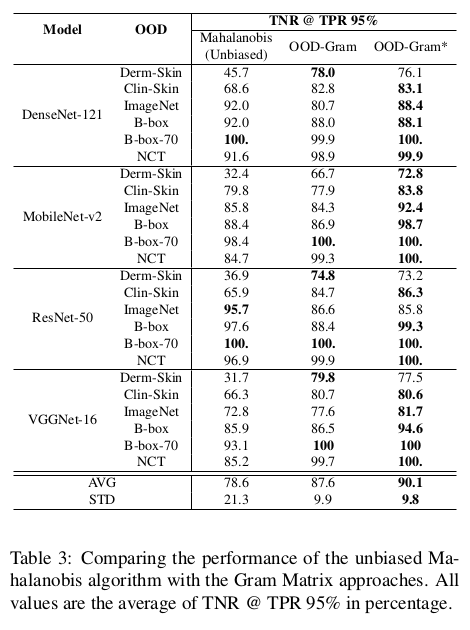
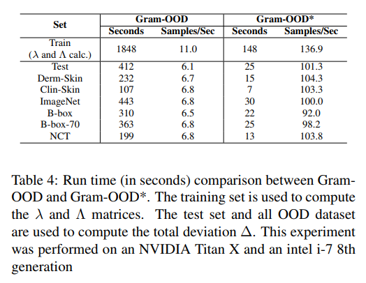
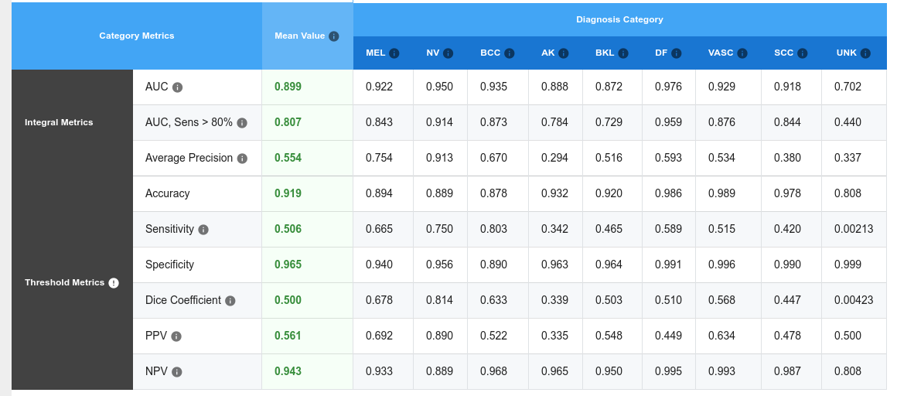

# On Out-of-Distribution Detection Algorithms with Deep Neural Skin CancerClassifiers
Code for the ISIC Skin Image Analysis Workshop  at CVPR 2020.
Download: soon

For the Mahalanobis, ODIN, and Baseline, please, refer to the following repositories:
- [ODIN: Out-of-Distribution Detector for Neural Networks](https://github.com/facebookresearch/odin)
- [A Simple Unified Framework for Detecting Out-of-Distribution Samples and Adversarial Attacks](https://github.com/pokaxpoka/deep_Mahalanobis_detector/)

# How to run
- Install the dependencies: `pip install -r requirements.txt`
- Download data and checkpoints running the `setup.sh` script.
- Run the network notebook (ex: `sk_mobilenet.ipynb`)

If you don't want to use the script, you can download data [from here](https://www.dropbox.com/s/nl3la5hhvfjn8hp/data.zip?dl=0) and the [checkpoints from here](https://www.dropbox.com/s/rnddrlxc9lbazcq/checkpoints.zip?dl=0).

ISIC unknown detection is available on [isic_submit folder](isic_submit).

# Results
## Unbiased performance in terms of TNR @ TPR 95%

## Running time for Gram-OOD and Gram-OOD*

## ISIC 2019 unknown detection - Resnet-50

Team on [live leaderboard](https://challenge2019.isic-archive.com/live-leaderboard.html): Gram-OOD - UNK detection using Gram-OOD* - Resnet

The remaining results are available on [this folder](isic_submit/merge/submissions/metrics/)

